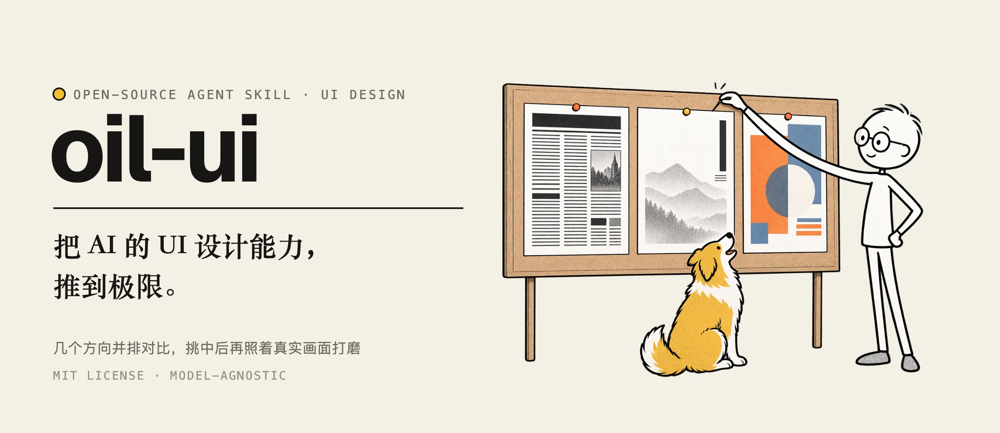
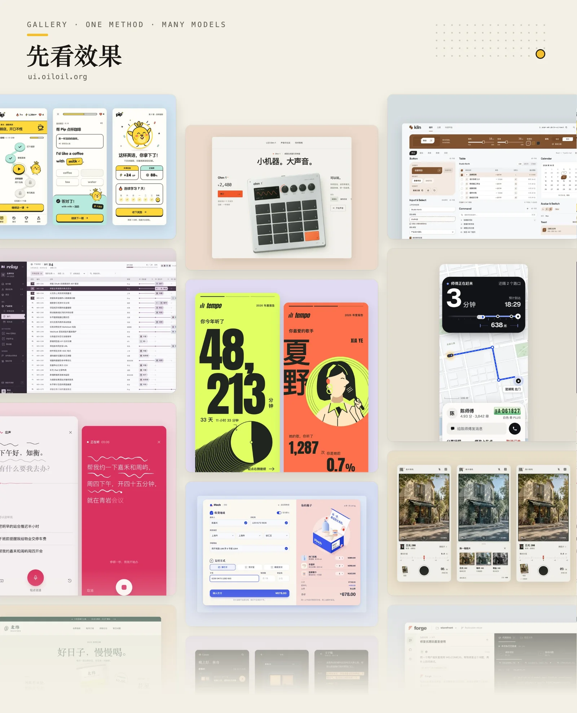
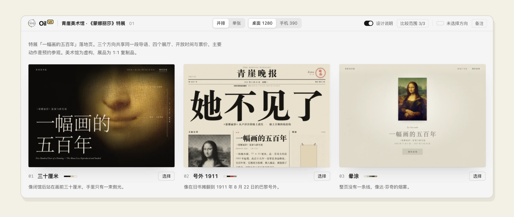
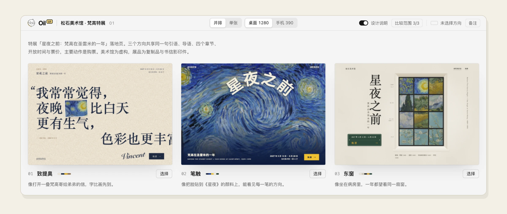

中文 · [English](README.en.md)

<p align="center">
  
</p>

<p align="center">
  <a href="https://ui.oiloil.org"></a>
</p>

Oil UI 是给 AI Agent 用的界面设计 Skill：先拉开几种真正不同的设计方向放在一起让你挑，再照着真实画面打磨。网站、App、后台和组件都能做。想看更多效果，可以去 [ui.oiloil.org](https://ui.oiloil.org)。

## 它怎么设计

1. **先看清这是什么产品。** 动手之前，先说清楚它属于哪一类，再找出同类里风格最鲜明的两三家，看它们是怎么做的、为什么这么做，然后决定哪些沿用、哪些换掉。
2. **把“高级”“简洁”翻成具体的决定。** 这类词人人都会说，却落不到画面上。它会先从题材、受众和品牌语气定下调性，比如热闹还是安静、精致还是粗粝、信息排得密还是疏，再把调性翻成看得见的选择：用什么字体、留多少白、颜色占多大面积。
3. **每个方向都从一样具体的东西出发。** 可以是一种材质和它所在的环境、一个场景、一个角色，也可以借用另一个领域的整套表现方式。灵感从产品本身找，不从“简约”“大气”这类形容词出发。
4. **先想清楚首屏是给谁看的。** 来看内容、挑东西或者干活的页面，首屏就应该是内容本身；要说服别人的页面，才需要先定首屏的版式，再写文案。
5. **几个方向要真的不一样。** 版式、字体、配色和主视觉这四样里，任意两个方向最多只能有一样相同。小样做出来后并排放着，眯起眼睛看首屏的明暗分布，太像了就重新定版式，不靠换个颜色补救。
6. **留一处让人记住的地方。** 不求整页都用力，只把一两处做到极致，比如点按时的反馈、付款成功的那一下、AI 干活的过程，或者一个 404 页面，其余地方保持安静。
7. **好不好看由你来定。** 几份小样放进同一个对比页，由你挑一个，再说说具体喜欢和不喜欢哪里。它按你的意见收紧之后，再往下做。
8. **以真实画面为准。** 做完会在电脑和手机尺寸下打开页面截图检查，也可以请一位没看过制作过程的评审来挑问题。最后做一轮减法：一页只留一个主角，删掉不影响理解的文字、重复的线和多余的框。

想让界面更好用、改造老项目，或者做流光、点阵这类特效，可以看看 [Oil UI Pro](https://ui.oiloil.org/pro/)，区别见[下文](#开源版和-pro)。

## 安装

把这句话交给支持安装 Skill 的 Agent：

```text
请帮我安装这个 Skill：https://github.com/oil-oil/oil-ui
```

或者在终端运行：

```bash
npx skills add oil-oil/oil-ui
```

装好就能用，不需要额外配置。有新版本时，Agent 会在回复末尾提醒你，想更新直接让它更新就行。已经装了 Oil UI Pro 的话，就不用再装开源版，两个同时装会抢着接同一类请求。

## 使用

直接把任务告诉 Agent，例如：

- “用 oil-ui 给这个课程预约产品探索几种设计方向，做成可以预览的页面。”
- “做三种字体、配色和构图都不同的设计，放在对比页里让我选。”
- “帮我润色这个页面，按项目现有的设计规范来。”
- “只评审这个首页，告诉我哪里要改、怎么改，不要动文件。”
- “按这张截图还原页面，参考图里没有的手机布局也补上。”

有品牌资料、截图或现成的项目，可以一起交给它。没有参考也能开始，只有在不清楚要交付什么的时候，它才会来问你。

## 自带的风格对比页

<p align="center">
  
</p>

想比较几份设计时，它会把它们并排放进同一个页面。放进去的可以是 HTML 文件、图片，也可以是正在运行的开发页面，现在的版本可以放在第一个当对照。你可以切换电脑和手机尺寸、点开看实际大小、用方向键翻看。看中哪一份就点“选择”，把复制出来的一句话发给 Agent，它会接着往下做。

## 开源版和 Pro

<p align="center">
  
</p>

开源版能把一个新页面从头做到好看。Pro 在这之上，帮你把界面做得好用、把老项目改好，并用更严格的评审和精修把质量往上推。

| | Oil UI 开源版 | Oil UI Pro |
| --- | :---: | :---: |
| 设计方向：认品类、定调性、拉开方向、风格对比页 | ✓ | ✓ |
| 视觉：层级、字体、配色、留白、配图和动效 | ✓ | ✓ |
| 让人记住的一刻和滚动叙事（视差、一镜到底） | ✓ | ✓ |
| 截图还原 | ✓ | ✓ |
| 小游戏的演出节奏、手感、生成素材和实时 3D | ✓ | ✓ |
| 独立评审 | 打分并列出问题 | 以 9 分为目标反复评审修改；检查几个方向有没有撞车；按真实任务把页面用一遍 |
| 精修：AI 默认审美自查、细节清单、怎么做减法 | | ✓ |
| 好用：交互和状态、表单、弹窗与浮层、电脑和手机上的布局 | | ✓ |
| 后台和工具：按产品挑工作区布局，让风格贯穿整页 | | ✓ |
| 老项目：优化 UI、改流程、加新功能各有一套做法 | 帮你分清是哪一种 | ✓ |
| 把单个组件打磨到极致 | | ✓ |
| 19 套卡片原型和代码、空间折展容器 | | ✓ |
| 流光、点阵、流动渐变这类特效 | | ✓ |
| 小游戏的场景布局、视觉和状态检查 | | ✓ |

Oil UI Pro 69 元，一次买断，永久更新，在 [ui.oiloil.org/pro](https://ui.oiloil.org/pro/) 购买。

## 搭配使用

- [draw-ui](https://github.com/oil-oil/draw-ui)：先用生图工具出设计图，挑中了再照图实现。写代码做出来的设计怎么改都不满意，而你的 Agent 又能生成图片时，可以换它试试。
- [oil-motion](https://github.com/oil-oil/oil-motion)：用生成的视频或序列帧做随滚动、拖动变化的网页动画，比如产品拆解、镜头穿越。想要很强的首屏动画时用它。

## 许可

[MIT](LICENSE)
